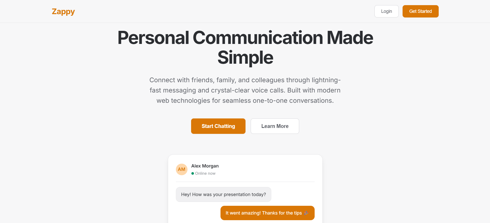

# 📌 Zappy – Real-Time Chat Web App

**Zappy** is a real-time chat platform with private and group messaging, built with **Node.js, Express, MongoDB, EJS**, and **WebSockets (Socket.IO)**.  
It features **JWT authentication**, **email verification via Brevo**, and **WebRTC video calling** for a secure and engaging chat experience.

---

## 🚀 Features
- 🔒 **JWT Authentication** – Secure login and registration  
- 📧 **Email OTP Verification (Brevo)** – Verify users before account activation  
- 💬 **Private & Group Chat** – Real-time messaging with Socket.IO  
- 🟢 **Online/Offline Status** – Live presence indicators  
- ⌨ **Typing Indicator** – See when someone is typing  
- 📞 **WebRTC Calling** – Video and audio calls in-browser  
- 📱 **Responsive UI** – Mobile-friendly EJS templates  
- 🛠 **Future Enhancements:** File & image sharing, message reactions, dark mode  

---

## 🛠 Tech Stack
**Frontend:** EJS, CSS, JavaScript  
**Backend:** Node.js, Express.js  
**Database:** MongoDB (Mongoose)  
**Real-time:** Socket.IO  
**Authentication:** JWT + Email OTP (Brevo API)  
**Validation:** Joi  
**UI Enhancements:** Connect-Flash for alerts  

---

## 📸 Screenshots

### 🏠 Home Page

### 🔑 Login with OTP Verification

### 📊 Dashboard

### 💬 Private Chat

### 👥 Group Chat

### 📩 Access Request

### ✅ Request Approval

---

## ⚡ Getting Started

### 1️⃣ Clone the repository
git clone https://github.com/yourusername/zappy.git  
cd zappy  

### 2️⃣ Install dependencies
npm install  

### 3️⃣ Set environment variables  
Create a `.env` file in the root directory and add:  
PORT=5000
MONGO_URI=your_mongodb_connection_string
JWT_SECRET=your_jwt_secret
JWT_EXPIRES_IN=30d
BREVO_MAIL=your_brevo_smtp_email
BREVO_PASS=your_brevo_smtp_password
BREVO_API_KEY=your_brevo_api_key
SESSION_SECRET=your_session_secret

### 4️⃣ Run the application locally
npm start  

Visit **http://localhost:5000** in your browser.

---

## 🌐 Live Demo
🔗 [Zappy on Render](https://zappy-3.onrender.com)

---

## 📜 License
MIT License – Free to use and modify.
